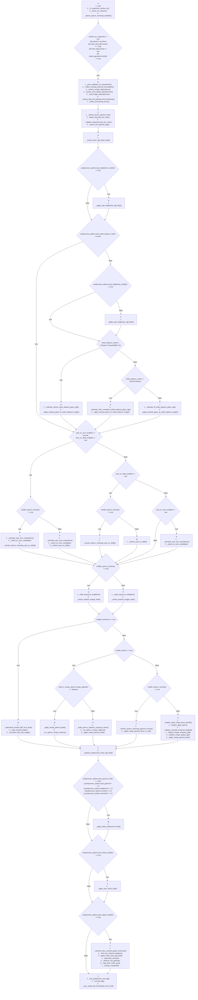

```mermaid
graph TD
    A["A<br/>1. run()<br/>2. _is_supported_runtime_os()<br/>3. _parse_run_options()<br/>4. _derive_opencv_tonemap_enabled()"]
    D1{"runtime_os_supported == true<br/>&& parsed is not None<br/>&& input_dng.suffix.lower() == '.dng'<br/>&& input_dng.exists() == true<br/>&& output_jpg.parent.exists() == true"}
    B["B<br/>1. _print_validated_run_parameters()<br/>2. _collect_missing_external_executables()<br/>3. _resolve_numpy_dependency()<br/>4. _resolve_auto_adjust_dependencies()<br/>5. _load_image_dependencies()<br/>6. _extract_dng_exif_payload_and_timestamp()<br/>7. _collect_processing_errors()"]
    C["C<br/>1. _extract_source_gamma_info()<br/>2. _detect_dng_bits_per_color()<br/>3. _validate_supported_bits_per_color()<br/>4. _extract_exif_gamma_tags()"]
    D["D<br/>1. _extract_base_rgb_linear_float()"]
    D2{"postprocess_options.auto_brightness_enabled == true"}
    E["E<br/>1. _apply_auto_brightness_rgb_float()"]
    D3{"postprocess_options.auto_white_balance_mode is None"}
    D4{"postprocess_options.auto_brightness_enabled == true"}
    F["F<br/>1. _apply_auto_brightness_rgb_float()"]
    D5{"white_balance_mode in {'Simple','GrayworldWB','IA'}"}
    G["G<br/>1. _estimate_xphoto_white_balance_gains_rgb()<br/>2. _apply_channel_gains_to_white_balance_image()"]
    D6{"white_balance_mode == 'ColorConstancy'"}
    H["H<br/>1. _estimate_color_constancy_white_balance_gains_rgb()<br/>2. _apply_channel_gains_to_white_balance_image()"]
    I["I<br/>1. _estimate_ttl_white_balance_gains_rgb()<br/>2. _apply_channel_gains_to_white_balance_image()"]
    D7{"auto_ev_zero_enabled == true && auto_ev_delta_enabled == true"}
    D8{"enable_opencv_tonemap == true"}
    J["J<br/>1. _calculate_auto_zero_evaluations()<br/>2. _select_ev_zero_candidate()<br/>3. _resolve_opencv_tonemap_auto_ev_delta()"]
    K["K<br/>1. _calculate_auto_zero_evaluations()<br/>2. _select_ev_zero_candidate()<br/>3. _resolve_auto_ev_delta()"]
    D9{"auto_ev_delta_enabled == true"}
    D10{"enable_opencv_tonemap == true"}
    L["L<br/>1. _resolve_opencv_tonemap_auto_ev_delta()"]
    M["M<br/>1. _resolve_auto_ev_delta()"]
    D11{"auto_ev_zero_enabled == true"}
    N["N<br/>1. _calculate_auto_zero_evaluations()<br/>2. _select_ev_zero_candidate()"]
    D12{"enable_opencv_tonemap == true"}
    O["O<br/>1. _build_exposure_multipliers()<br/>2. _extract_bracket_images_float()"]
    P["P<br/>1. _build_exposure_multipliers()<br/>2. _extract_bracket_images_float()"]
    D13{"enable_luminance == true"}
    Q["Q<br/>1. _materialize_bracket_tiffs_from_float()<br/>2. _order_bracket_paths()<br/>3. _normalize_float_rgb_image()"]
    D14{"enable_opencv == true"}
    D15{"opencv_merge_options.merge_algorithm == 'Mertens'"}
    R["R<br/>1. _apply_merge_gamma_float()<br/>2. _run_opencv_merge_mertens()"]
    S["S<br/>1. _build_opencv_radiance_exposure_times()<br/>2. _run_opencv_merge_radiance()<br/>3. _apply_merge_gamma_float()"]
    D16{"enable_opencv_tonemap == true"}
    T["T<br/>1. _resolve_opencv_tonemap_gamma_inverse()<br/>2. _apply_merge_gamma_float_no_clip()"]
    U["U<br/>1. _hdrplus_build_scalar_proxy_float32()<br/>2. _hdrplus_align_layers()<br/>3. _hdrplus_compute_temporal_weights()<br/>4. _hdrplus_merge_temporal_rgb()<br/>5. _hdrplus_merge_spatial_rgb()<br/>6. _apply_merge_gamma_float()"]
    V["V<br/>1. _prepare_postprocess_entry_rgb_float()"]
    D17{"postprocess_options.post_gamma_mode == 'auto'<br/>|| postprocess_options.post_gamma != 1.0<br/>|| postprocess_options.brightness != 1.0<br/>|| postprocess_options.contrast != 1.0<br/>|| postprocess_options.saturation != 1.0"}
    W["W<br/>1. _apply_static_postprocess_float()"]
    D18{"postprocess_options.auto_levels_enabled == true"}
    X["X<br/>1. _apply_auto_levels_float()"]
    D19{"postprocess_options.auto_adjust_enabled == true"}
    Y["Y<br/>1. _selective_blur_contrast_gated_vectorized()<br/>2. _level_per_channel_adaptive()<br/>3. _apply_clahe_luma_rgb_float()<br/>4. _sigmoidal_contrast()<br/>5. _vibrance_hsl_gamma()<br/>6. _high_pass_math_gray()<br/>7. _overlay_composite()"]
    Z["Z<br/>1. _clip_postprocess_exit_rgb()<br/>2. _encode_jpg()<br/>3. _sync_output_file_timestamps_from_exif()"]

    A --> D1
    D1 -- true --> B
    B --> C
    C --> D
    D --> D2
    D2 -- true --> E
    D2 -- false --> D3
    E --> D3
    D3 -- true --> D7
    D3 -- false --> D4
    D4 -- true --> D5
    D4 -- false --> F
    F --> D5
    D5 -- true --> G
    D5 -- false --> D6
    D6 -- true --> H
    D6 -- false --> I
    G --> D7
    H --> D7
    I --> D7
    D7 -- true --> D8
    D8 -- true --> J
    D8 -- false --> K
    J --> D12
    K --> D12
    D7 -- false --> D9
    D9 -- true --> D10
    D10 -- true --> L
    D10 -- false --> M
    L --> D12
    M --> D12
    D9 -- false --> D11
    D11 -- true --> N
    D11 -- false --> D12
    N --> D12
    D12 -- true --> O
    D12 -- false --> P
    O --> D13
    P --> D13
    D13 -- true --> Q
    D13 -- false --> D14
    D14 -- true --> D15
    D15 -- true --> R
    D15 -- false --> S
    D14 -- false --> D16
    D16 -- true --> T
    D16 -- false --> U
    Q --> V
    R --> V
    S --> V
    T --> V
    U --> V
    V --> D17
    D17 -- true --> W
    D17 -- false --> D18
    W --> D18
    D18 -- true --> X
    D18 -- false --> D19
    X --> D19
    D19 -- true --> Y
    D19 -- false --> Z
    Y --> Z
```
