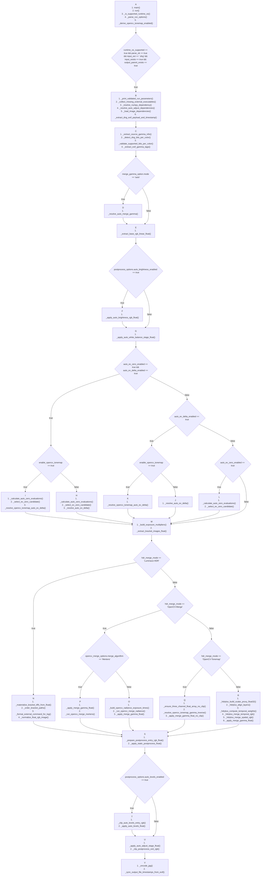

```mermaid
graph TD
    A["A<br/>1. main()<br/>2. run()<br/>3. _is_supported_runtime_os()<br/>4. _parse_run_options()<br/>5. _derive_opencv_tonemap_enabled()"]
    X1{"runtime_os_supported == true && parse_ok == true && input_ext == '.dng' && input_exists == true && output_parent_exists == true"}
    B["B<br/>1. _print_validated_run_parameters()<br/>2. _collect_missing_external_executables()<br/>3. _resolve_numpy_dependency()<br/>4. _resolve_auto_adjust_dependencies()<br/>5. _load_image_dependencies()<br/>6. _extract_dng_exif_payload_and_timestamp()"]
    C["C<br/>1. _extract_source_gamma_info()<br/>2. _detect_dng_bits_per_color()<br/>3. _validate_supported_bits_per_color()<br/>4. _extract_exif_gamma_tags()"]
    X2{"merge_gamma_option.mode == 'auto'"}
    D["D<br/>1. _resolve_auto_merge_gamma()"]
    E["E<br/>1. _extract_base_rgb_linear_float()"]
    X3{"postprocess_options.auto_brightness_enabled == true"}
    F["F<br/>1. _apply_auto_brightness_rgb_float()"]
    G["G<br/>1. _apply_auto_white_balance_stage_float()"]
    X4{"auto_ev_zero_enabled == true && auto_ev_delta_enabled == true"}
    X5{"enable_opencv_tonemap == true"}
    H["H<br/>1. _calculate_auto_zero_evaluations()<br/>2. _select_ev_zero_candidate()<br/>3. _resolve_auto_ev_delta()"]
    I["I<br/>1. _calculate_auto_zero_evaluations()<br/>2. _select_ev_zero_candidate()<br/>3. _resolve_opencv_tonemap_auto_ev_delta()"]
    X6{"auto_ev_delta_enabled == true"}
    X7{"enable_opencv_tonemap == true"}
    J["J<br/>1. _resolve_auto_ev_delta()"]
    K["K<br/>1. _resolve_opencv_tonemap_auto_ev_delta()"]
    X8{"auto_ev_zero_enabled == true"}
    L["L<br/>1. _calculate_auto_zero_evaluations()<br/>2. _select_ev_zero_candidate()"]
    M["M<br/>1. _build_exposure_multipliers()<br/>2. _extract_bracket_images_float()"]
    X9{"hdr_merge_mode == 'Luminace-HDR'"}
    N["N<br/>1. _materialize_bracket_tiffs_from_float()<br/>2. _order_bracket_paths()<br/>3. _format_external_command_for_log()<br/>4. _normalize_float_rgb_image()"]
    X10{"hdr_merge_mode == 'OpenCV-Merge'"}
    X11{"opencv_merge_options.merge_algorithm == 'Mertens'"}
    O["O<br/>1. _build_opencv_radiance_exposure_times()<br/>2. _run_opencv_merge_radiance()<br/>3. _apply_merge_gamma_float()"]
    P["P<br/>1. _apply_merge_gamma_float()<br/>2. _run_opencv_merge_mertens()"]
    X12{"hdr_merge_mode == 'OpenCV-Tonemap'"}
    Q["Q<br/>1. _ensure_three_channel_float_array_no_clip()<br/>2. _resolve_opencv_tonemap_gamma_inverse()<br/>3. _apply_merge_gamma_float_no_clip()"]
    R["R<br/>1. _hdrplus_build_scalar_proxy_float32()<br/>2. _hdrplus_align_layers()<br/>3. _hdrplus_compute_temporal_weights()<br/>4. _hdrplus_merge_temporal_rgb()<br/>5. _hdrplus_merge_spatial_rgb()<br/>6. _apply_merge_gamma_float()"]
    S["S<br/>1. _prepare_postprocess_entry_rgb_float()<br/>2. _apply_static_postprocess_float()"]
    X13{"postprocess_options.auto_levels_enabled == true"}
    T["T<br/>1. _clip_auto_levels_entry_rgb()<br/>2. _apply_auto_levels_float()"]
    U["U<br/>1. _apply_auto_adjust_stage_float()<br/>2. _clip_postprocess_exit_rgb()"]
    V["V<br/>1. _encode_jpg()<br/>2. _sync_output_file_timestamps_from_exif()"]

    A --> X1
    X1 -- true --> B
    B --> C
    C --> X2
    X2 -- true --> D
    X2 -- false --> E
    D --> E
    E --> X3
    X3 -- true --> F
    X3 -- false --> G
    F --> G
    G --> X4
    X4 -- true --> X5
    X5 -- true --> I
    X5 -- false --> H
    X4 -- false --> X6
    X6 -- true --> X7
    X7 -- true --> K
    X7 -- false --> J
    X6 -- false --> X8
    X8 -- true --> L
    X8 -- false --> M
    H --> M
    I --> M
    J --> M
    K --> M
    L --> M
    M --> X9
    X9 -- true --> N
    X9 -- false --> X10
    X10 -- true --> X11
    X11 -- true --> P
    X11 -- false --> O
    X10 -- false --> X12
    X12 -- true --> Q
    X12 -- false --> R
    N --> S
    O --> S
    P --> S
    Q --> S
    R --> S
    S --> X13
    X13 -- true --> T
    X13 -- false --> U
    T --> U
    U --> V
```
