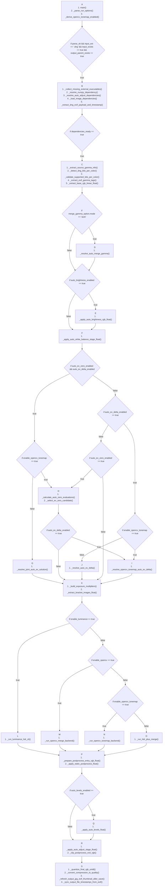

```mermaid
graph TD
    A["A<br/>1. main()<br/>2. _parse_run_options()<br/>3. _derive_opencv_tonemap_enabled()"]
    d1{"if parse_ok && input_ext == '.dng' && input_exists == true && output_parent_exists == true"}
    B["B<br/>1. _collect_missing_external_executables()<br/>2. _resolve_numpy_dependency()<br/>3. _resolve_auto_adjust_dependencies()<br/>4. _load_image_dependencies()<br/>5. _extract_dng_exif_payload_and_timestamp()"]
    d2{"if dependencies_ready == true"}
    C["C<br/>1. _extract_source_gamma_info()<br/>2. _detect_dng_bits_per_color()<br/>3. _validate_supported_bits_per_color()<br/>4. _extract_exif_gamma_tags()<br/>5. _extract_base_rgb_linear_float()"]
    d3{"if merge_gamma_option.mode == 'auto'"}
    D["D<br/>1. _resolve_auto_merge_gamma()"]
    d4{"if auto_brightness_enabled == true"}
    E["E<br/>1. _apply_auto_brightness_rgb_float()"]
    F["F<br/>1. _apply_auto_white_balance_stage_float()"]
    d5{"if auto_ev_zero_enabled && auto_ev_delta_enabled"}
    d6{"if enable_opencv_tonemap == true"}
    G["G<br/>1. _resolve_joint_auto_ev_solution()"]
    H["H<br/>1. _calculate_auto_zero_evaluations()<br/>2. _select_ev_zero_candidate()"]
    d7{"if auto_ev_delta_enabled == true"}
    d8{"if auto_ev_delta_enabled == true"}
    d9{"if enable_opencv_tonemap == true"}
    I["I<br/>1. _resolve_opencv_tonemap_auto_ev_delta()"]
    J["J<br/>1. _resolve_auto_ev_delta()"]
    d10{"if auto_ev_zero_enabled == true"}
    K["K<br/>1. _build_exposure_multipliers()<br/>2. _extract_bracket_images_float()"]
    d11{"if enable_luminance == true"}
    L["L<br/>1. _run_luminance_hdr_cli()"]
    d12{"if enable_opencv == true"}
    M["M<br/>1. _run_opencv_merge_backend()"]
    d13{"if enable_opencv_tonemap == true"}
    N["N<br/>1. _run_opencv_tonemap_backend()"]
    O["O<br/>1. _run_hdr_plus_merge()"]
    P["P<br/>1. _prepare_postprocess_entry_rgb_float()<br/>2. _apply_static_postprocess_float()"]
    d14{"if auto_levels_enabled == true"}
    Q["Q<br/>1. _apply_auto_levels_float()"]
    R["R<br/>1. _apply_auto_adjust_stage_float()<br/>2. _clip_postprocess_exit_rgb()"]
    S["S<br/>1. _quantize_final_rgb_uint8()<br/>2. _convert_compression_to_quality()<br/>3. _refresh_output_jpg_exif_thumbnail_after_save()<br/>4. _sync_output_file_timestamps_from_exif()"]

    A --> d1
    d1 -- true --> B
    B --> d2
    d2 -- true --> C
    C --> d3
    d3 -- true --> D
    d3 -- false --> d4
    D --> d4
    d4 -- true --> E
    d4 -- false --> F
    E --> F
    F --> d5
    d5 -- true --> d6
    d6 -- true --> H
    d6 -- false --> G
    G --> K
    H --> d7
    d7 -- true --> I
    d7 -- false --> K
    d5 -- false --> d8
    d8 -- true --> d9
    d9 -- true --> I
    d9 -- false --> J
    J --> K
    d8 -- false --> d10
    d10 -- true --> H
    d10 -- false --> K
    I --> K
    K --> d11
    d11 -- true --> L
    d11 -- false --> d12
    d12 -- true --> M
    d12 -- false --> d13
    d13 -- true --> N
    d13 -- false --> O
    L --> P
    M --> P
    N --> P
    O --> P
    P --> d14
    d14 -- true --> Q
    d14 -- false --> R
    Q --> R
    R --> S
```
